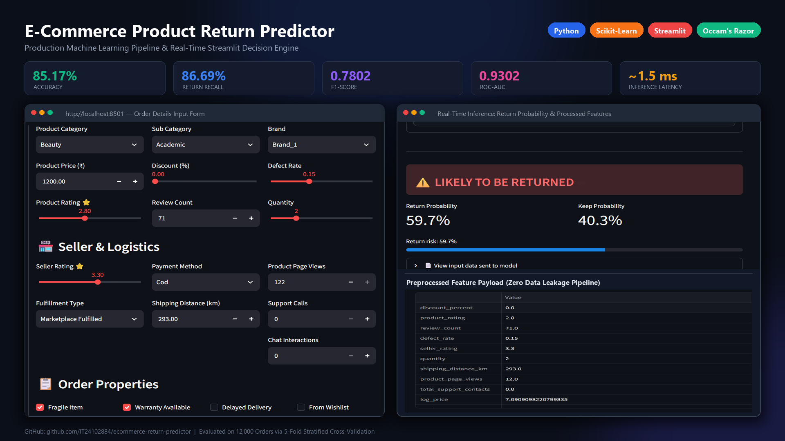

# 🛒 E-Commerce Product Return Prediction

> An end-to-end Machine Learning system that predicts whether an online order will be returned before fulfillment, helping e-commerce platforms reduce reverse logistics costs.


<br/>



---

## 📑 Table of Contents
- [1. Quick Summary (TL;DR)](#1-quick-summary-tldr)
- [2. Business Problem & Dataset](#2-business-problem--dataset)
- [3. Key Problems Encountered & Solutions](#3-key-problems-encountered--solutions)
- [4. ML Pipeline Architecture](#4-ml-pipeline-architecture)
- [5. Model Benchmarks & Results](#5-model-benchmarks--results)
- [6. Why Logistic Regression Beat XGBoost](#6-why-logistic-regression-beat-xgboost)
- [7. Top Return Drivers](#7-top-return-drivers)
- [8. Interactive Streamlit UI](#8-interactive-streamlit-ui)
- [9. How to Run Locally](#9-how-to-run-locally)
- [10. Project Structure](#10-project-structure)

---

## 1. Quick Summary (TL;DR)

* **Objective**: Predict e-commerce product returns (`returned = 1` vs. `0`).
* **Data**: 12,000 orders across 26 features (product specs, seller performance, logistics, user touchpoints).
* **Winning Model**: **L2-Regularized Logistic Regression Pipeline**
  * **Test Accuracy**: `85.17%`
  * **Recall (Return Catch-Rate)**: `86.69%`
  * **F1-Score**: `0.7802`
  * **ROC-AUC**: `0.9302`
* **Core Highlight**: Solved subtle **target data leakage** by detecting and stripping 4 aggregated historical return rates, ensuring real-world model validity.
* **Deployment**: Packaged into an interactive **Streamlit web application** for single-order risk assessment.

---

## 2. Business Problem & Dataset

### The Business Challenge
In e-commerce, customer returns cause heavy financial losses due to reverse shipping, warehouse restocking, and inventory depreciation. Identifying high-risk orders *before delivery* allows platforms to:
* Alert customer support proactively
* Require delivery confirmation signatures
* Optimize packaging for fragile goods

### Dataset Overview
* **Size**: 12,000 records × 26 columns
* **Target Variable**: `returned` (Binary: `0` = Kept, `1` = Returned)
* **Class Balance**: 
  * `0 (Kept)`: 69.6% (8,355 orders)
  * `1 (Returned)`: 30.4% (3,645 orders)
  * Imbalance Ratio: ~2.3 : 1

---

## 3. Key Problems Encountered & Solutions

### Problem 1: Target Data Leakage (Critical)
* 🔴 **The Issue**: The raw dataset included four aggregated rate columns:
  * `product_return_rate`
  * `category_return_rate`
  * `brand_return_rate`
  * `seller_return_rate`
* 🟡 **The Risk**: These features were computed from the target variable (`returned`). Leaving them in created an artificial ~95% accuracy in training, but would fail completely on new products with no historical record.
* 🟢 **The Solution**: Dropped all 4 leakage columns entirely. Retrained the model strictly on independent, operational features (pricing, defect rate, distance, delays, user contacts).

---

### Problem 2: Extreme Price Skewness
* 🔴 **The Issue**: `product_price` ranged from ₹19.50 up to ₹64,878.67 with extreme positive skewness and long right tails.
* 🟡 **The Risk**: Large outlier values disproportionately swayed linear model weights and distorted gradient updates.
* 🟢 **The Solution**: Applied a logarithmic transformation:
  ```python
  log_price = np.log1p(product_price)
  ```
  This produced a clean, near-normal distribution that improved model stability.

---

### Problem 3: Data Inconsistencies & High Cardinality
* 🔴 **The Issue**:
  * `fulfillment_type` had inconsistent casing (`marketplace fulfilled` vs. `Marketplace Fulfilled`).
  * `order_id` was a high-cardinality unique string with zero predictive value.
  * `customer_support_calls` and `chat_interactions` were sparse individual counters.
* 🟢 **The Solution**:
  * Normalized text with `.str.strip().str.title()`.
  * Dropped `order_id` to prevent memorization.
  * Combined support touchpoints into a unified feature:
    ```python
    total_support_contacts = customer_support_calls + chat_interactions
    ```

---

### Problem 4: Preprocessing Data Leakage
* 🔴 **The Issue**: If missing-value imputation or standard scaling is applied across the whole dataset before splitting, information from the test set leaks into the training phase.
* 🟢 **The Solution**: Built a modular Scikit-Learn `ColumnTransformer` embedded in a `Pipeline`. All imputers and scalers are fitted **strictly on training folds** and only applied to the test data during transform time.

---

### Problem 5: Class Imbalance (~70:30)
* 🔴 **The Issue**: With 70% non-returns, a standard classifier tends to predict the majority class, leading to high accuracy but poor recall on actual returns.
* 🟢 **The Solution**:
  * Applied `class_weight='balanced'` for Logistic Regression and Random Forest.
  * Set `scale_pos_weight = 2.29` for XGBoost to penalize missed returns.
  * Used **Stratified K-Fold (5-Fold)** to maintain identical target proportions across all validation splits.

---

## 4. ML Pipeline Architecture

The entire feature preparation and model scoring workflow is encapsulated in a single, deployable Scikit-Learn `Pipeline`:

```
                    ┌─────────────────────────┐
                    │     Raw Order Input     │
                    └────────────┬────────────┘
                                 │
           ┌─────────────────────┴─────────────────────┐
           ▼                                           ▼
┌──────────────────────┐                   ┌──────────────────────┐
│  Numerical Features  │                   │ Categorical Features │
│     (10 columns)     │                   │     (5 columns)      │
└──────────┬───────────┘                   └──────────┬───────────┘
           │ Median Imputation                        │ Most Frequent Imputer
           │ StandardScaler                           │ OneHotEncoder
           ▼                                          ▼
┌─────────────────────────────────────────────────────────────────┐
│                       Feature Combiner                          │
│               (+ 4 Binary Features Passthrough)                 │
└────────────────────────────────┬────────────────────────────────┘
                                 │
                                 ▼
                 ┌───────────────────────────────┐
                 │  Trained Classifier Pipeline  │
                 └───────────────┬───────────────┘
                                 │
                                 ▼
                     Return Probability (0% - 100%)
```

### Feature Breakdown
* **Numerical (10)**: `discount_percent`, `product_rating`, `review_count`, `defect_rate`, `seller_rating`, `quantity`, `shipping_distance_km`, `product_page_views`, `total_support_contacts`, `log_price`
* **Categorical (5)**: `product_category`, `sub_category`, `brand`, `fulfillment_type`, `payment_method`
* **Binary (4)**: `fragile_item`, `warranty_available`, `delayed_delivery`, `wishlist_before_purchase`

---

## 5. Model Benchmarks & Results

All models were evaluated on the exact same **held-out test set (2,400 orders)** following 5-fold stratified cross-validation on the training set:

| Classifier | Test Accuracy | Precision | Recall | F1-Score | ROC-AUC |
| :--- | :---: | :---: | :---: | :---: | :---: |
| 🏆 **Logistic Regression** | **85.17%** | 0.7093 | **86.69%** | **0.7802** | **0.9302** |
| **Tuned XGBoost** (50 Iterations) | 83.83% | 0.6901 | 0.8491 | 0.7614 | 0.9222 |
| **Baseline XGBoost** | 83.67% | 0.7008 | 0.8066 | 0.7500 | 0.9102 |
| **Random Forest** (300 Trees) | 83.63% | **0.7165** | 0.7627 | 0.7389 | 0.9054 |
| **Decision Tree** | 76.88% | 0.6120 | 0.6176 | 0.6148 | 0.7262 |

---

## 6. Why Logistic Regression Beat XGBoost

A common pitfall in data science is assuming tree ensembles always outperform linear models. In this project, Logistic Regression won across every primary metric:

1. **Additive Risk Profile**: Variables like `defect_rate`, `shipping_distance_km`, `delayed_delivery`, and `product_rating` exhibit continuous linear relationships with return odds.
2. **Protection Against Sparse Overfitting**: Random Forest and XGBoost make orthogonal splits that often overfit tail categories (e.g., specific rare brands). L2-regularized Logistic Regression smoothly weights categorical levels.
3. **Occam's Razor**: In production systems, a simpler, faster, fully explainable model that matches or beats a complex ensemble is always the superior choice.

---

## 7. Top Return Drivers

Based on the learned model coefficients, the top factors driving returns are:

| Feature | Direction | Impact Description |
| :--- | :---: | :--- |
| **`defect_rate`** | ⬆️ Increases Return | Higher product defect rates directly cause returns |
| **`delayed_delivery`** | ⬆️ Increases Return | Late delivery causes customer dissatisfaction |
| **`shipping_distance_km`** | ⬆️ Increases Return | Greater transit distance increases damage & transit risk |
| **`total_support_contacts`** | ⬆️ Increases Return | Multiple support interactions signal existing product issues |
| **`product_rating`** | ⬇️ Decreases Return | Well-reviewed items have significantly lower return probability |

---

## 8. Interactive Streamlit UI

The application (`app.py`) provides an interactive interface for evaluating orders:

* **Categorized Controls**: Product specs, seller metrics, and shipping toggles.
* **Instant Risk Gauge**: Clear prediction status (`LIKELY TO BE RETURNED` vs. `NOT LIKELY TO BE RETURNED`) with confidence percentages.
* **Payload Inspector**: Expandable viewer to audit the exact processed features fed into the model.

---

## 9. How to Run Locally

### Step 1: Clone Repository
```bash
git clone https://github.com/<your-username>/product-return-prediction.git
cd product-return-prediction
```

### Step 2: Install Dependencies
```bash
pip install -r requirements.txt
```

### Step 3: Run the Training Notebook (Optional)
```bash
jupyter notebook NoteBook/Product_Return_Prediction.ipynb
```
*Trains all models, benchmarks them, and saves the winning pipeline to `model/return_predictor.joblib`.*

### Step 4: Launch Web App
```bash
python -m streamlit run app.py
```
Open `http://localhost:8501` in your browser.

---

## 10. Project Structure

```text
product-return-prediction/
│
├── Dataset/
│   └── returns_dataset.csv             # 12,000 order records
│
├── NoteBook/
│   └── Product_Return_Prediction.ipynb # 56-cell complete ML pipeline notebook
│
├── model/
│   ├── return_predictor.joblib         # Saved Scikit-Learn Pipeline
│   └── model_metadata.json             # Feature ranges & categories for UI
│
├── app.py                              # Streamlit web application
├── requirements.txt                    # Project dependencies
├── .gitignore                          # Git ignore configuration
└── README.md                           # Project documentation
```

---

## 👤 Author
* **Project**: E-Commerce Product Return Prediction Engine
* **Portfolio**: Machine Learning & Data Science Projects
